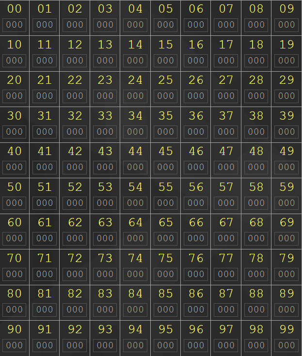
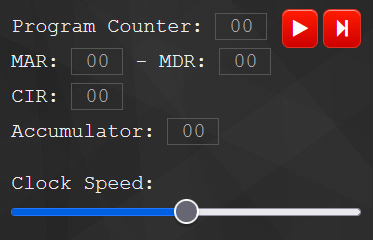
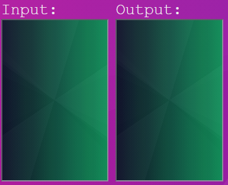
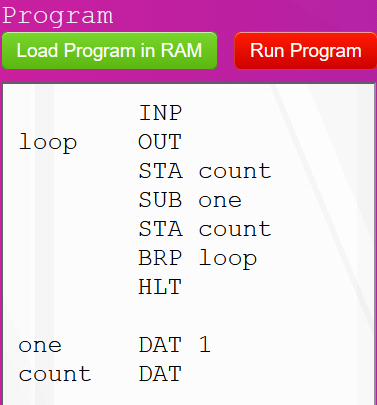

# Anotações da Semana 02

## Assembly

Assembly (ou assembler) é uma linguagem de máquina simbólica. Isso significa que as instruções em código binário direcionadas ao computador são substituídas por pequenas sequências de caracteres que podem ser lidas por um ser humano. Essas pequenas sequências são chamadas mnemônicos (ADD, SUB, STA etc.). Para trabalhar com a linguagem assembly, fazemos uso do simulador de um computador com a arquitetura de Von Neumann, chamado Little Man Computer (LMC).

### Estrutura Sintática

- **ADD** \<ADDR> := ACCUMULATOR ← ACCUMULATOR + RAM[\<ADDR>]
- **BRA** \<ADDR> := PROGRAM COUNTER ← \<ADDR>
- **BRP** \<ADDR> := IF ACCUMULATOR >= 0 THEN PROGRAM COUNTER ← \<ADDR>
- **BRZ** \<ADDR> := IF ACCUMULATOR == 0 THEN PROGRAM COUNTER ← \<ADDR>
- var **DAT** VAL := RAM[\<FREE ADDR>] ← VAL
- **HLT** := HALT
- **INP** := ACCUMULATOR ← INPUT
- **LDA** \<ADDR> := ACCUMULATOR ← RAM[\<ADDR>]
- **OUT** := OUTPUT ← ACCUMULATOR
- **STA** \<ADDR> := RAM[\<ADDR>] ← ACCUMULATOR
- **SUB** \<ADDR> := ACCUMULATOR ← ACCUMULATOR - RAM[\<ADDR>]

## Máquina de von Neumann

A máquina de von Neumann se caracteriza por guardar as instruções de um programa e os dados fornecidos/obtidos na mesma memória compartilhada. Esse tipo de arquitetura permite que um computador alterne entre tarefas sem que haja remanejamento físico dos seus componentes.

## Componentes de um Computador

As partes mais importantes até então de um computador são descritas a seguir.

1. **Random Access Memory (RAM)**

    A memória RAM é um espaço de armazenamento de dados em um computador. Ela possui células indexadas, cujo índice é chamado de **address** (ou endereço) e cujo valor é chamado de **data** (ou dado). O tempo que se leva para acessar cada uma das células é igual, independentemente de sua posição, devido à indexação.

    No simulador LMC, temos 100 células na memória RAM. Cada célula possui um espaço máximo de cerca de 12 bits (isso equivale a um número com três dígitos em base decimal). Os endereços são números inteiros de 0 a 99, como se vê na imagem a seguir.

    

2. **Core Processing Unit (CPU)**

    A CPU é a parte principal de um computador. Ela é responsável por acessar dados na memória, ler e decodificar as instruções de um algoritmo, e fazer o processamento matemático dos dados. Essas tarefas acontecem por meio dos **registers** (ou registradores/processadores), que são as partes que formam a CPU. O ciclo representado pela ordenação dessas tarefas é chamado de **FDE cycle** (fetch, decode, and execute).

    No simulador LMC, trabalhamos com cinco tipos de registradores. Cada um deles é descrito a seguir.
    
    2.1. **Program Counter (PC)**\
    &emsp;&emsp;Armazena o endereço de memória da próxima instrução a ser executada pela CPU.

    2.2. **Memory Address Register (MAR)**\
    &emsp;&emsp;Armazena o endereço que um determinado dado a ser lido/escrito ocupa/ocupará na memória RAM.

    2.3. **Memory Data Register (MDR)**\
    &emsp;&emsp;Armazena o dado ser lido/escrito no endereço apontado pelo MAR.

    2.4. **Current Instruction Register (CIR)**\
    &emsp;&emsp;Armazena a instrução que está sendo decodificada e executada pela CPU em um determinado instante.

    2.5. **Accumulator**\
    &emsp;&emsp;Armazena o resultado das instruções e das operações matemáticas.

    Na figura, pode-se observar que o LMC dispõe dos cinco componentes descritos. Para além disso, vale notar que a barra indicada por **Clock Speed** regula a quantidade máxima de ciclos FDE executados a cada segundo. Arrastá-la para a direita faz com que o programa seja executado mais rápido.

    

3. **Input/Output (I/O)**

    As telas de INPUT e OUTPUT são responsáveis por exibir, respectivamente, os valores inseridos pelo usuário da aplicação quando o comando INP é executado e os valores resultantes das operações internas da CPU quando o comando OUT é executado.

    

4. **Editor de Texto**

    O editor de texto organiza os mnemônicos sequencialmente para que o computador possa alcançar um objetivo com a execução das operações, isto é, para que um programador possa construir um algoritmo na linguagem assembly. O botão "load program in RAM" transfere as informações contidas nesse documento para a memória RAM. As instruções são traduzidas para código binário (no LMC, para código em números decimais) de maneira que a máquina possa lê-los. O passo de tradução é feito por um **compilador**.

    A tradução feita pelo compilador acontece em duas etapas: primeiro, ele busca pelas variáveis, pelos rótulos e pelos seus tipos para montar uma **symbol table** (ou tabela de símbolos). Dessa maneira, é possível rotular endereços de memória com determinadas instruções para fazer um laço funcionar. Depois disso, o compilador executa as instruções sequencialmente, atribuindo valor às variáveis encontradas no primeiro passo.

    