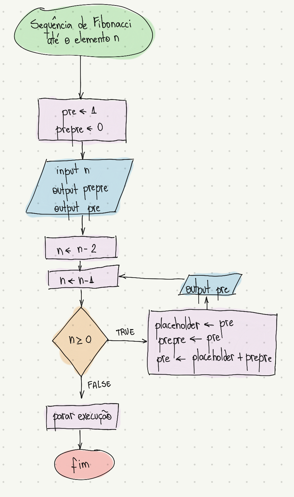

# Sequência de Fibonacci
A Sequência de Fibonacci é uma sucessão de números inteiros que começa com 0 e 1, em que cada termo seguinte é a soma dos dois anteriores. Como essa sucessão é infinita, o algoritmo proposto nesse exercício imprime os N primeiros termos da sequência.

## Código
O código em Assembly está no arquivo *fibonacci.asm*.

## Fluxograma
